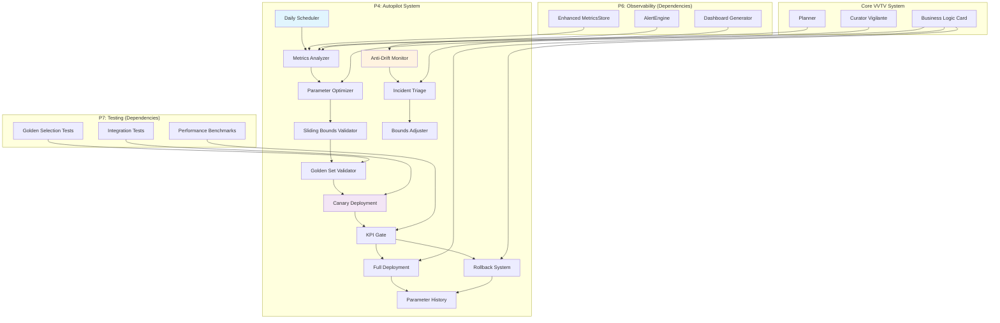

# Design Document

## Overview

This design implements P4 (Autopilot D+1 & Drift Guards) as an autonomous parameter optimization system that builds on the P6 observability and P7 testing infrastructure. The autopilot system performs daily analysis of business metrics, proposes safe parameter adjustments, validates changes through canary deployments, and maintains system stability through anti-drift mechanisms.

## Architecture



## Components and Interfaces

### 1. Autopilot Engine Core

**Location:** `vvtv-core/src/autopilot/mod.rs`

```rust
pub struct AutopilotEngine {
    metrics_store: Arc<MetricsStore>,
    business_logic_path: PathBuf,
    history_dir: PathBuf,
    config: AutopilotConfig,
    bounds: SlidingBounds,
    scheduler: DailyScheduler,
    canary_system: CanaryDeployment,
    drift_monitor: AntiDriftMonitor,
}

pub struct AutopilotConfig {
    pub enabled: bool,
    pub daily_schedule_utc: String, // "03:00"
    pub canary_duration_minutes: u32,
    pub canary_traffic_percentage: f32,
    pub statistical_confidence_threshold: f64,
    pub max_execution_time_minutes: u32,
    pub emergency_pause: bool,
    pub manual_override_hours: u32,
}

pub struct AutopilotCycle {
    pub cycle_id: String,
    pub started_at: DateTime<Utc>,
    pub metrics_analysis: MetricsAnalysis,
    pub proposed_changes: Vec<ParameterChange>,
    pub validation_results: ValidationResults,
    pub deployment_result: DeploymentResult,
}
```

**Key Methods:**
- `run_daily_cycle() -> Result<AutopilotCycle>`
- `analyze_metrics(window: Duration) -> Result<MetricsAnalysis>`
- `propose_parameter_changes(analysis: &MetricsAnalysis) -> Result<Vec<ParameterChange>>`
- `validate_and_deploy(changes: &[ParameterChange]) -> Result<DeploymentResult>`

### 2. Sliding Bounds System

**Location:** `vvtv-core/src/autopilot/sliding_bounds.rs`

```rust
pub struct SlidingBounds {
    bounds: HashMap<String, ParameterBounds>,
    history: VecDeque<BoundsAdjustment>,
    config: SlidingBoundsConfig,
}

pub struct ParameterBounds {
    pub parameter_name: String,
    pub min_value: f64,
    pub max_value: f64,
    pub current_value: f64,
    pub stability_days: u32,
    pub rollback_count: u32,
    pub last_updated: DateTime<Utc>,
}

pub struct SlidingBoundsConfig {
    pub expansion_rate_per_week: f64, // 0.05 = 5%
    pub contraction_rate_after_rollback: f64, // 0.25 = 25%
    pub stability_threshold_days: u32, // 7 days
    pub rollback_threshold: u32, // 3 rollbacks
    pub anti_windup_enabled: bool,
}

pub enum BoundsAdjustment {
    Expansion { parameter: String, old_range: (f64, f64), new_range: (f64, f64) },
    Contraction { parameter: String, old_range: (f64, f64), new_range: (f64, f64) },
    AntiWindup { parameter: String, reason: String },
}
```

**Key Methods:**
- `validate_change(parameter: &str, new_value: f64) -> Result<bool>`
- `expand_bounds_for_stable_parameters() -> Result<Vec<BoundsAdjustment>>`
- `contract_bounds_after_rollback(parameter: &str) -> Result<BoundsAdjustment>`
- `apply_anti_windup_protection(parameter: &str) -> Result<()>`

### 3. Canary Deployment System

**Location:** `vvtv-core/src/autopilot/canary.rs`

```rust
pub struct CanaryDeployment {
    config: CanaryConfig,
    metrics_store: Arc<MetricsStore>,
    test_environment: TestEnvironment,
}

pub struct CanaryConfig {
    pub traffic_percentage: f32, // 0.2 = 20%
    pub duration_minutes: u32, // 60 minutes
    pub confidence_threshold: f64, // 0.95 = 95%
    pub kpi_metrics: Vec<BusinessMetricType>,
    pub rollback_on_degradation: bool,
}

pub struct CanaryResult {
    pub canary_id: String,
    pub control_metrics: MetricsSummary,
    pub canary_metrics: MetricsSummary,
    pub statistical_significance: f64,
    pub confidence_level: f64,
    pub recommendation: CanaryRecommendation,
    pub execution_time: Duration,
}

pub enum CanaryRecommendation {
    Proceed { improvement_pct: f64 },
    Rollback { degradation_pct: f64 },
    Inconclusive { reason: String },
}
```

**Key Methods:**
- `deploy_canary(changes: &[ParameterChange]) -> Result<String>`
- `monitor_canary(canary_id: &str) -> Result<CanaryResult>`
- `calculate_statistical_significance(control: &[f64], canary: &[f64]) -> (f64, f64)`
- `make_deployment_decision(result: &CanaryResult) -> CanaryRecommendation`

### 4. Anti-Drift Monitor

**Location:** `vvtv-core/src/autopilot/drift_monitor.rs`

```rust
pub struct AntiDriftMonitor {
    metrics_store: Arc<MetricsStore>,
    config: DriftConfig,
    drift_history: VecDeque<DriftEvent>,
}

pub struct DriftConfig {
    pub prediction_error_threshold_pct: f64, // 30%
    pub rollback_rate_threshold_pct: f64, // 10%
    pub monitoring_window_days: u32, // 14 days
    pub pause_duration_hours: u32, // 48 hours
    pub max_pause_duration_days: u32, // 7 days
}

pub struct DriftEvent {
    pub event_type: DriftEventType,
    pub detected_at: DateTime<Utc>,
    pub metrics: DriftMetrics,
    pub action_taken: DriftAction,
}

pub enum DriftEventType {
    PredictionErrorHigh,
    RollbackRateHigh,
    ConsecutiveFailures,
    SystemInstability,
}

pub enum DriftAction {
    ContinueMonitoring,
    PauseAutopilot { duration: Duration },
    ContractBounds { parameters: Vec<String> },
    TriggerIncidentTriage,
}
```

**Key Methods:**
- `check_for_drift() -> Result<Vec<DriftEvent>>`
- `calculate_prediction_error(window: Duration) -> Result<f64>`
- `calculate_rollback_rate(window: Duration) -> Result<f64>`
- `apply_drift_protection(events: &[DriftEvent]) -> Result<Vec<DriftAction>>`

### 5. Parameter History and Versioning

**Location:** `vvtv-core/src/autopilot/history.rs`

```rust
pub struct ParameterHistory {
    history_dir: PathBuf,
    current_version: Option<ParameterVersion>,
}

pub struct ParameterVersion {
    pub version_id: String, // SHA256 hash
    pub timestamp: DateTime<Utc>,
    pub changes: Vec<ParameterChange>,
    pub rationale: String,
    pub deployment_result: Option<DeploymentResult>,
    pub file_path: PathBuf,
}

pub struct ParameterChange {
    pub parameter_name: String,
    pub old_value: serde_json::Value,
    pub new_value: serde_json::Value,
    pub change_type: ChangeType,
    pub confidence: f64,
    pub expected_impact: ExpectedImpact,
}

pub enum ChangeType {
    Optimization,
    Correction,
    Exploration,
    Rollback,
}

pub struct ExpectedImpact {
    pub selection_entropy_delta: Option<f64>,
    pub curator_budget_delta: Option<f64>,
    pub novelty_kld_delta: Option<f64>,
    pub overall_confidence: f64,
}
```

**Key Methods:**
- `store_version(business_logic: &BusinessLogic, changes: &[ParameterChange]) -> Result<ParameterVersion>`
- `rollback_to_version(version_id: &str) -> Result<BusinessLogic>`
- `get_version_history(limit: usize) -> Result<Vec<ParameterVersion>>`
- `cleanup_old_versions(retention_days: u32) -> Result<usize>`

### 6. Incident Triage System

**Location:** `vvtv-core/src/autopilot/incident_triage.rs`

```rust
pub struct IncidentTriage {
    metrics_store: Arc<MetricsStore>,
    history: Arc<ParameterHistory>,
    config: TriageConfig,
}

pub struct TriageConfig {
    pub weekly_schedule_utc: String, // "Sunday 02:00"
    pub analysis_window_days: u32, // 7 days
    pub failure_threshold_for_patch: u32, // 3 occurrences
    pub github_integration_enabled: bool,
}

pub struct TriageReport {
    pub report_id: String,
    pub analysis_period: (DateTime<Utc>, DateTime<Utc>),
    pub failure_categories: HashMap<FailureCategory, Vec<FailureInstance>>,
    pub patch_suggestions: Vec<PatchSuggestion>,
    pub github_issues: Vec<GitHubIssue>,
    pub bounds_adjustments: Vec<BoundsAdjustment>,
}

pub enum FailureCategory {
    PerformanceDegradation,
    StabilityIssues,
    ValidationFailures,
    CanaryRollbacks,
    DriftDetection,
}

pub struct PatchSuggestion {
    pub category: FailureCategory,
    pub parameter: String,
    pub suggested_bounds: (f64, f64),
    pub rationale: String,
    pub confidence: f64,
}
```

**Key Methods:**
- `run_weekly_triage() -> Result<TriageReport>`
- `categorize_failures(window: Duration) -> Result<HashMap<FailureCategory, Vec<FailureInstance>>>`
- `generate_patch_suggestions(failures: &HashMap<FailureCategory, Vec<FailureInstance>>) -> Result<Vec<PatchSuggestion>>`
- `create_github_issues(suggestions: &[PatchSuggestion]) -> Result<Vec<GitHubIssue>>`

## Data Models

### Configuration Schema

```yaml
# Autopilot configuration
autopilot:
  enabled: true
  daily_schedule_utc: "03:00"
  canary_duration_minutes: 60
  canary_traffic_percentage: 0.2
  statistical_confidence_threshold: 0.95
  max_execution_time_minutes: 10
  emergency_pause: false
  manual_override_hours: 24

  sliding_bounds:
    expansion_rate_per_week: 0.05
    contraction_rate_after_rollback: 0.25
    stability_threshold_days: 7
    rollback_threshold: 3
    anti_windup_enabled: true

  drift_monitoring:
    prediction_error_threshold_pct: 30.0
    rollback_rate_threshold_pct: 10.0
    monitoring_window_days: 14
    pause_duration_hours: 48
    max_pause_duration_days: 7

  incident_triage:
    weekly_schedule_utc: "Sunday 02:00"
    analysis_window_days: 7
    failure_threshold_for_patch: 3
    github_integration_enabled: false
```

### Database Schema Extensions

```sql
-- Autopilot execution history
CREATE TABLE autopilot_cycles (
    cycle_id TEXT PRIMARY KEY,
    started_at TEXT NOT NULL,
    completed_at TEXT,
    status TEXT NOT NULL, -- 'running', 'completed', 'failed', 'rolled_back'
    metrics_analysis TEXT, -- JSON
    proposed_changes TEXT, -- JSON
    deployment_result TEXT, -- JSON
    error_message TEXT
);

-- Parameter bounds tracking
CREATE TABLE parameter_bounds (
    parameter_name TEXT PRIMARY KEY,
    min_value REAL NOT NULL,
    max_value REAL NOT NULL,
    current_value REAL NOT NULL,
    stability_days INTEGER DEFAULT 0,
    rollback_count INTEGER DEFAULT 0,
    last_updated TEXT NOT NULL,
    bounds_history TEXT -- JSON array of adjustments
);

-- Canary deployment results
CREATE TABLE canary_deployments (
    canary_id TEXT PRIMARY KEY,
    cycle_id TEXT NOT NULL,
    started_at TEXT NOT NULL,
    completed_at TEXT,
    traffic_percentage REAL NOT NULL,
    control_metrics TEXT, -- JSON
    canary_metrics TEXT, -- JSON
    statistical_significance REAL,
    recommendation TEXT, -- 'proceed', 'rollback', 'inconclusive'
    FOREIGN KEY (cycle_id) REFERENCES autopilot_cycles(cycle_id)
);

-- Drift events and actions
CREATE TABLE drift_events (
    event_id TEXT PRIMARY KEY,
    event_type TEXT NOT NULL,
    detected_at TEXT NOT NULL,
    metrics TEXT, -- JSON
    action_taken TEXT NOT NULL,
    resolved_at TEXT
);

-- Incident triage reports
CREATE TABLE triage_reports (
    report_id TEXT PRIMARY KEY,
    generated_at TEXT NOT NULL,
    analysis_period_start TEXT NOT NULL,
    analysis_period_end TEXT NOT NULL,
    failure_categories TEXT, -- JSON
    patch_suggestions TEXT, -- JSON
    github_issues TEXT -- JSON
);
```

## Error Handling and Safety

### 1. Fail-Safe Mechanisms

```rust
impl AutopilotEngine {
    async fn run_daily_cycle_with_safety(&self) -> Result<AutopilotCycle> {
        // Timeout protection
        let cycle_future = self.run_daily_cycle();
        match timeout(Duration::from_secs(self.config.max_execution_time_minutes * 60), cycle_future).await {
            Ok(Ok(cycle)) => Ok(cycle),
            Ok(Err(e)) => {
                self.handle_cycle_failure(&e).await?;
                Err(e)
            }
            Err(_) => {
                let timeout_error = AutopilotError::Timeout(self.config.max_execution_time_minutes);
                self.handle_cycle_failure(&timeout_error).await?;
                Err(timeout_error.into())
            }
        }
    }

    async fn handle_cycle_failure(&self, error: &AutopilotError) -> Result<()> {
        // Log failure with full context
        tracing::error!(
            target: "autopilot",
            error = %error,
            cycle_id = %self.current_cycle_id(),
            "autopilot cycle failed"
        );

        // Trigger emergency protocols if needed
        match error {
            AutopilotError::ValidationFailure(_) => {
                self.pause_autopilot_temporarily().await?;
            }
            AutopilotError::CanaryFailure(_) => {
                self.rollback_current_changes().await?;
            }
            AutopilotError::Timeout(_) => {
                self.alert_operators_immediately().await?;
            }
            _ => {}
        }

        Ok(())
    }
}
```

### 2. Rollback Safety

```rust
impl ParameterHistory {
    async fn atomic_rollback(&self, version_id: &str) -> Result<BusinessLogic> {
        // Validate target version exists and is valid
        let target_version = self.get_version(version_id)?
            .ok_or(AutopilotError::VersionNotFound(version_id.to_string()))?;

        // Load and validate the historical configuration
        let historical_config = self.load_business_logic_from_version(&target_version)?;
        historical_config.validate()?;

        // Create backup of current state before rollback
        let current_config = BusinessLogic::load_from_file(&self.current_config_path)?;
        let backup_version = self.store_version(&current_config, &[], "pre_rollback_backup")?;

        // Atomic file replacement
        let temp_path = self.current_config_path.with_extension("tmp");
        self.write_business_logic(&historical_config, &temp_path)?;
        fs::rename(&temp_path, &self.current_config_path)?;

        // Verify rollback success
        let restored_config = BusinessLogic::load_from_file(&self.current_config_path)?;
        if restored_config != historical_config {
            // Emergency restore from backup
            self.restore_from_backup(&backup_version).await?;
            return Err(AutopilotError::RollbackVerificationFailed);
        }

        Ok(restored_config)
    }
}
```

## Testing Strategy

### 1. Unit Tests

- **Sliding Bounds Logic**: Test expansion, contraction, and anti-windup mechanisms
- **Statistical Calculations**: Validate canary significance testing and confidence intervals
- **Parameter Validation**: Test bounds checking and constraint enforcement
- **History Management**: Test versioning, rollback, and cleanup operations

### 2. Integration Tests

- **End-to-End Autopilot Cycle**: Full cycle from metrics analysis to deployment
- **Canary Deployment Flow**: Control/canary split, monitoring, and decision making
- **Drift Detection Scenarios**: Simulate various drift conditions and verify responses
- **Emergency Rollback**: Test rollback mechanisms under various failure conditions

### 3. Simulation Tests

- **30-Day Autopilot Simulation**: Extended operation with realistic parameter drift
- **Failure Injection**: Test system behavior under various failure modes
- **Performance Regression**: Validate that autopilot doesn't degrade system performance
- **Statistical Validation**: Verify canary deployment statistical methods

## Implementation Phases

### Phase 1: Core Autopilot Engine (5 days)
- Implement AutopilotEngine with daily scheduling
- Build metrics analysis and parameter optimization logic
- Create basic parameter change proposal system
- Add configuration management and validation

### Phase 2: Sliding Bounds System (3 days)
- Implement SlidingBounds with expansion/contraction logic
- Add anti-windup protection mechanisms
- Create bounds validation and adjustment systems
- Integrate with parameter change proposals

### Phase 3: Canary Deployment (4 days)
- Build CanaryDeployment system with traffic splitting
- Implement statistical significance testing
- Create KPI gate decision logic
- Add rollback mechanisms for failed canaries

### Phase 4: Anti-Drift and History (3 days)
- Implement AntiDriftMonitor with prediction error tracking
- Build ParameterHistory with versioning and rollback
- Add drift detection and protection mechanisms
- Create parameter history management

### Phase 5: Incident Triage (2 days)
- Build IncidentTriage with weekly analysis
- Implement failure categorization and patch suggestions
- Add GitHub integration for issue creation
- Create triage reporting and bounds adjustment

### Phase 6: Integration and Testing (3 days)
- End-to-end integration with P6/P7 systems
- Comprehensive testing suite implementation
- Performance validation and optimization
- Documentation and operational procedures

## Operational Considerations

### 1. Monitoring and Alerting

- **Autopilot Health Dashboard**: Real-time status, recent changes, and performance metrics
- **Critical Alerts**: Cycle failures, rollback events, drift detection, and emergency pauses
- **Performance Tracking**: Prediction accuracy, deployment success rate, and system impact

### 2. Manual Override Procedures

- **Emergency Pause**: Immediate autopilot suspension via configuration flag
- **Parameter Bounds Override**: Temporary expansion of safety constraints for emergencies
- **Manual Rollback**: Operator-initiated rollback to specific historical versions

### 3. Maintenance and Updates

- **Weekly Triage Reviews**: Automated analysis with manual review of patch suggestions
- **Monthly Performance Reviews**: Analysis of autopilot effectiveness and system improvements
- **Quarterly Safety Audits**: Review of bounds settings, failure patterns, and safety mechanisms