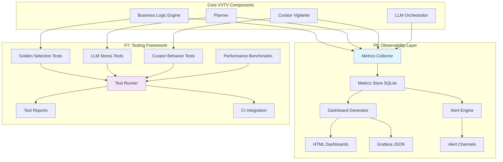

# Design Document

## Overview

This design implements P6 (Observability & Production Metrics) and P7 (Testing & Validation Suite) as foundational infrastructure for the VVTV system. The design focuses on comprehensive metrics collection, visual dashboards, automated alerting, and robust testing frameworks that will enable P4 (Autopilot) implementation.

## Architecture



## Components and Interfaces

### P6: Observability Components

#### 1. Enhanced Metrics Store

**Location:** `vvtv-core/src/monitor/metrics_store.rs`

```rust
pub struct EnhancedMetricsStore {
    db: Connection,
    retention_days: u32,
}

pub struct BusinessMetric {
    pub timestamp: DateTime<Utc>,
    pub metric_type: BusinessMetricType,
    pub value: f64,
    pub context: serde_json::Value,
}

pub enum BusinessMetricType {
    SelectionEntropy,
    CuratorApplyBudgetUsedPct,
    NoveltyTemporalKld,
    HdDetectionSlowRate,
    AutopilotPredVsRealError,
}
```

**Key Methods:**
- `record_business_metric(metric: BusinessMetric) -> Result<()>`
- `query_metrics(metric_type: BusinessMetricType, range: TimeRange) -> Result<Vec<BusinessMetric>>`
- `cleanup_expired_metrics() -> Result<usize>`

#### 2. Dashboard Generator

**Location:** `vvtv-core/src/monitor/dashboard_generator.rs`

```rust
pub struct DashboardGenerator {
    metrics_store: Arc<EnhancedMetricsStore>,
    template_engine: TemplateEngine,
}

pub struct DashboardConfig {
    pub title: String,
    pub time_range: TimeRange,
    pub metrics: Vec<BusinessMetricType>,
    pub format: DashboardFormat,
}

pub enum DashboardFormat {
    Html,
    GrafanaJson,
}
```

**Key Methods:**
- `generate_business_logic_overview() -> Result<Dashboard>`
- `generate_autopilot_health() -> Result<Dashboard>`
- `export_dashboard(dashboard: Dashboard, format: DashboardFormat) -> Result<String>`

#### 3. Alert Engine

**Location:** `vvtv-core/src/monitor/alert_engine.rs`

```rust
pub struct AlertEngine {
    metrics_store: Arc<EnhancedMetricsStore>,
    alert_rules: Vec<AlertRule>,
    channels: Vec<Box<dyn AlertChannel>>,
}

pub struct AlertRule {
    pub name: String,
    pub metric_type: BusinessMetricType,
    pub condition: AlertCondition,
    pub severity: AlertSeverity,
    pub cooldown: Duration,
}

pub enum AlertCondition {
    ThresholdBelow { value: f64, duration: Duration },
    ThresholdAbove { value: f64, duration: Duration },
    RateOfChange { threshold: f64, window: Duration },
}
```

### P7: Testing Framework Components

#### 1. Golden Selection Test Suite

**Location:** `vvtv-core/src/test_framework/golden_selection.rs`

```rust
pub struct GoldenSelectionTest {
    test_cases: Vec<GoldenTestCase>,
    business_logic: Arc<BusinessLogic>,
}

pub struct GoldenTestCase {
    pub name: String,
    pub seed: u64,
    pub candidates: Vec<Plan>,
    pub expected_order: Vec<String>,
    pub config_overrides: Option<BusinessLogic>,
}

pub struct GoldenTestResult {
    pub passed: bool,
    pub actual_order: Vec<String>,
    pub expected_order: Vec<String>,
    pub diff: Option<String>,
    pub execution_time: Duration,
}
```

#### 2. LLM Stress Test Framework

**Location:** `vvtv-core/src/test_framework/llm_stress.rs`

```rust
pub struct LlmStressTest {
    orchestrator: Arc<LlmOrchestrator>,
    config: StressTestConfig,
}

pub struct StressTestConfig {
    pub concurrent_calls: usize,
    pub total_calls: usize,
    pub timeout_scenarios: Vec<Duration>,
    pub failure_injection_rate: f64,
}

pub struct StressTestResult {
    pub total_calls: usize,
    pub successful_calls: usize,
    pub p95_latency: Duration,
    pub circuit_breaker_transitions: Vec<CircuitBreakerEvent>,
    pub fallback_activation_rate: f64,
}
```

#### 3. Performance Benchmark Suite

**Location:** `vvtv-core/src/test_framework/benchmarks.rs`

```rust
pub struct PerformanceBenchmarks {
    baseline_results: HashMap<String, BenchmarkResult>,
}

pub struct BenchmarkResult {
    pub name: String,
    pub p50_latency: Duration,
    pub p95_latency: Duration,
    pub throughput: f64,
    pub memory_usage: usize,
}

pub struct BenchmarkComparison {
    pub current: BenchmarkResult,
    pub baseline: BenchmarkResult,
    pub regression_detected: bool,
    pub performance_delta_pct: f64,
}
```

## Data Models

### Metrics Schema

```sql
-- Enhanced metrics table for business KPIs
CREATE TABLE business_metrics (
    id INTEGER PRIMARY KEY AUTOINCREMENT,
    timestamp TEXT NOT NULL,
    metric_type TEXT NOT NULL,
    value REAL NOT NULL,
    context TEXT, -- JSON context data
    created_at TEXT DEFAULT CURRENT_TIMESTAMP
);

CREATE INDEX idx_business_metrics_type_time ON business_metrics(metric_type, timestamp);
CREATE INDEX idx_business_metrics_cleanup ON business_metrics(created_at);

-- Alert state tracking
CREATE TABLE alert_state (
    rule_name TEXT PRIMARY KEY,
    last_triggered TEXT,
    current_state TEXT, -- 'ok', 'warning', 'critical'
    trigger_count INTEGER DEFAULT 0,
    last_updated TEXT DEFAULT CURRENT_TIMESTAMP
);

-- Test execution history
CREATE TABLE test_executions (
    id INTEGER PRIMARY KEY AUTOINCREMENT,
    test_suite TEXT NOT NULL,
    test_name TEXT NOT NULL,
    passed BOOLEAN NOT NULL,
    execution_time_ms INTEGER,
    details TEXT, -- JSON test details
    executed_at TEXT DEFAULT CURRENT_TIMESTAMP
);
```

### Configuration Schema

```yaml
# Enhanced monitoring configuration
monitoring:
  metrics:
    retention_days: 90
    collection_interval_seconds: 30
    batch_size: 100
  
  dashboards:
    business_logic_overview:
      enabled: true
      refresh_interval: "5m"
      metrics: ["selection_entropy", "curator_apply_budget_used_pct"]
    
    autopilot_health:
      enabled: true
      refresh_interval: "1m"
      metrics: ["autopilot_pred_vs_real_error", "novelty_temporal_kld"]
  
  alerts:
    diversity_loss:
      metric: "selection_entropy"
      threshold_below: 0.3
      duration: "60m"
      severity: "warning"
    
    curator_budget_exhausted:
      metric: "curator_apply_budget_used_pct"
      threshold_above: 0.9
      duration: "1h"
      severity: "critical"

# Testing framework configuration
testing:
  golden_selection:
    test_data_path: "test_data/golden_selection/"
    timeout_seconds: 5
    
  llm_stress:
    concurrent_calls: 1000
    timeout_scenarios: ["1s", "5s", "30s"]
    failure_injection_rate: 0.1
    
  benchmarks:
    regression_threshold_pct: 20
    baseline_file: "benchmarks/baseline.json"
```

## Error Handling

### Metrics Collection Resilience

```rust
impl EnhancedMetricsStore {
    pub async fn record_metric_safe(&self, metric: BusinessMetric) -> Result<()> {
        match self.record_business_metric(metric.clone()).await {
            Ok(()) => Ok(()),
            Err(e) => {
                // Log error but don't fail the main operation
                warn!(target: "metrics", "failed to record metric: {e}");
                // Optionally queue for retry
                self.queue_for_retry(metric).await?;
                Ok(())
            }
        }
    }
}
```

### Test Framework Error Recovery

```rust
impl GoldenSelectionTest {
    pub fn run_with_recovery(&self) -> Vec<GoldenTestResult> {
        self.test_cases.iter().map(|test_case| {
            match self.execute_test_case(test_case) {
                Ok(result) => result,
                Err(e) => GoldenTestResult {
                    passed: false,
                    actual_order: vec![],
                    expected_order: test_case.expected_order.clone(),
                    diff: Some(format!("Test execution failed: {e}")),
                    execution_time: Duration::ZERO,
                }
            }
        }).collect()
    }
}
```

## Testing Strategy

### Unit Tests

1. **Metrics Store Tests**
   - Metric recording and retrieval
   - Time range queries
   - Retention policy enforcement
   - Concurrent access safety

2. **Dashboard Generator Tests**
   - Template rendering with real data
   - Format conversion (HTML ↔ Grafana JSON)
   - Error handling for missing data

3. **Alert Engine Tests**
   - Rule evaluation logic
   - Cooldown period enforcement
   - Channel delivery mechanisms

### Integration Tests

1. **End-to-End Metrics Flow**
   - Business Logic Engine → Metrics Store → Dashboard
   - Alert triggering and delivery
   - Metrics cleanup and retention

2. **Golden Selection Validation**
   - Deterministic selection with fixed seeds
   - Configuration change impact testing
   - Edge case handling (tied scores, empty candidates)

3. **LLM Circuit Breaker Integration**
   - Timeout scenario simulation
   - Circuit breaker state transitions
   - Fallback mechanism activation

### Performance Tests

1. **Metrics Throughput**
   - 1000+ metrics/second recording
   - Query performance under load
   - Dashboard generation latency

2. **Selection Algorithm Benchmarks**
   - Gumbel-Top-k performance scaling
   - Memory usage profiling
   - Regression detection

## Implementation Phases

### Phase 1: Enhanced Metrics Infrastructure (3 days)
- Extend existing MetricsStore with business metrics
- Implement BusinessMetric types and collection points
- Add retention policy and cleanup mechanisms

### Phase 2: Dashboard and Alerting (2 days)
- Build DashboardGenerator with HTML/Grafana export
- Implement AlertEngine with configurable rules
- Create business logic and autopilot health dashboards

### Phase 3: Golden Selection Testing (2 days)
- Develop deterministic test framework
- Create comprehensive test case library
- Integrate with CI pipeline

### Phase 4: LLM and Performance Testing (2 days)
- Build LLM stress test framework
- Implement performance benchmarking suite
- Add regression detection and reporting

### Phase 5: Integration and Polish (1 day)
- End-to-end testing of complete observability stack
- Documentation and operational runbooks
- CI/CD integration and deployment validation