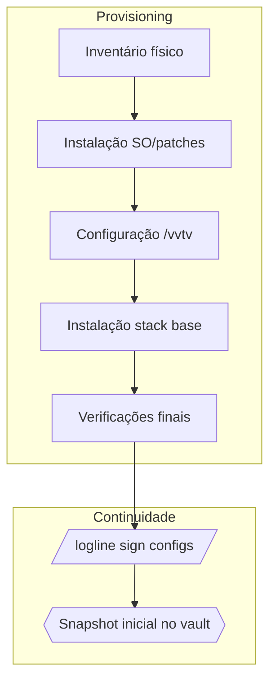

# Deployment Guide — VoulezVous.TV Industrial

Este guia descreve o ritual completo de provisionamento do nó broadcast descrito
no Bloco I e Apêndice D do `VVTV INDUSTRIAL DOSSIER.md`. Utilize-o sempre que um
novo host precisar entrar em operação ou após uma reinstalação limpa.

## Visão Geral



## Pré-requisitos

1. Hardware homologado (Mac mini M1/M2 ou host x86 com QuickSync).
2. Acesso físico para aplicar padrões visuais e conectar UPS ≥1500 VA.
3. Rede cabeada estável com Tailscale autorizado no domínio `voulezvous.ts.net`.
4. Token de autenticação do repositório `voulezvous-tv-Rust` clonado localmente.

## Passo a passo

1. **Atualização do sistema operacional**
   ```bash
   softwareupdate --install --all    # macOS
   sudo apt update && sudo apt full-upgrade -y
   ```
2. **Provisionar estrutura `/vvtv`**
   ```bash
   sudo ./scripts/system/init_edge_node.sh --base /vvtv
   sudo ./scripts/system/init_vault.sh --vault /vvtv/vault
   ```
3. **Instalar dependências críticas** (`FFmpeg`, `SQLite`, `Chromium`, `NGINX-RTMP`)
   ```bash
   ./scripts/install/bootstrap_ffmpeg.sh
   ./scripts/install/bootstrap_nginx.sh
   ./scripts/install/bootstrap_chromium.sh
   ```
4. **Aplicar hardening mínimo**
   ```bash
   sudo ./scripts/system/apply_firewall.sh --config configs/firewall.toml
   sudo ./scripts/system/security_rotate_keys.sh
   ```
5. **Configurar configs TOML**
   ```bash
   install -Dm644 configs/*.toml /vvtv/system/configs/
   logline sign --key voulezvous_foundation.pem /vvtv/system/configs/*.toml
   ```
6. **Validar serviços base**
   ```bash
   ./vvtvctl --config configs/vvtv.toml status
   ./scripts/system/check_stream_health.sh --verbose
   ./scripts/system/run_sqlite_integrity.sh /vvtv/data
   ```
7. **Registrar snapshot inicial**
   ```bash
   ./scripts/system/backup_cold.sh --target /vvtv/vault/snapshots
   ```

## Pós-instalação

- Execute `docs/operations/manual_do_operador.md#checklist-diário` para iniciar
a rotina diária.
- Agende `scripts/system/compliance_scan.sh` via cron para rodar ao menos uma
vez por dia.
- Documente qualquer desvio no `docs/adr/` correspondente e assine com
`logline sign`.

## Referências

- `VVTV INDUSTRIAL DOSSIER.md`, Bloco I (linhas 120–430).
- `docs/operations/runbooks.md` para fluxos de fallback.
