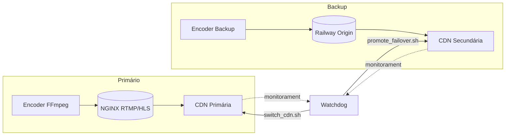

# Failover & Recovery Playbook

Este playbook cobre os cenários de troca de origin, CDN e restabelecimento após
incidentes, conforme Bloco VI e Apêndice F do `VVTV INDUSTRIAL DOSSIER.md`.

## Topologia de Failover



## Checklist de Falha

1. Confirme o alerta (telegram/email) e valide via
   `./scripts/system/check_stream_health.sh`.
2. Capture estado atual:
   ```bash
   ./vvtvctl status --format json > /vvtv/system/logs/status_$(date -u +%s).json
   ```
3. Execute o runbook correspondente:
   - Falha de origin: `./scripts/system/promote_failover.sh --target railway`
   - Falha de CDN primária: `./scripts/system/switch_cdn.sh --to backup`
   - Queda completa: `./scripts/system/standby.sh && ./scripts/system/resume.sh`
4. Valide stream externo:
   ```bash
   ./scripts/system/check_stream_health.sh --external --timeout 30
   ```
5. Registre incidente:
   ```bash
   ./scripts/system/takedown.sh --id <plan_id>  # se aplicável
   echo "$(date -u) FAILOVER" >> /vvtv/system/logs/incident_log.md
   ```

## Fluxo de Retorno ao Primário

1. Diagnostique e corrija causa raiz (consultar `docs/operations/runbooks.md`).
2. Promova o origin original:
   ```bash
   ./scripts/system/promote_failover.sh --target primary
   ./scripts/system/switch_cdn.sh --to primary
   ```
3. Reative monitoramento e watchdogs:
   ```bash
   systemctl restart vvtv-watchdog.service
   ```
4. Atualize `docs/compliance/license_audit.md` com o incidente, anexando hashes
   de logs e ações corretivas.

## Pós-Failover

- Rode `./scripts/system/compliance_scan.sh` para garantir que nenhuma mídia
  corrompida ou não licenciada entrou na pipeline durante o evento.
- Atualize `vault/snapshots` com `./scripts/system/backup_hot.sh`.
- Execute `docs/operations/manual_do_operador.md#pós-incidente`.

## Referências

- `VVTV INDUSTRIAL DOSSIER.md`, Bloco VI (linhas 1800–2250).
- `docs/compliance/compliance_response.md` para notificações a stakeholders.
