# Manual do Operador VoulezVous.TV

Manual físico/digital para operadores de plantão. Baseado no Apêndice H do
`VVTV INDUSTRIAL DOSSIER.md` e atualizado com os scripts dos PRs Epic L.

## Rotina do Turno

```mermaid
gantt
    title Turno Padrão (8h)
    dateFormat HH:mm
    section Preparação
    Check-in e checklist físico       :a1, 00:00, 00:20
    Sincronizar estado com turno anterior :a2, after a1, 00:10
    section Execução
    Monitoramento ativo (logs, métricas) :b1, after a2, 03:00
    QA spot-check (vvtvctl qa smoke-test) :b2, after b1, 00:30
    Documentação e compliance scan        :b3, after b2, 00:30
    section Encerramento
    Atualizar runbook e checklist final :c1, after b3, 00:20
    Handover                            :c2, after c1, 00:10
```



## Checklist de Início de Turno

1. Higiene visual conforme padrão (luvas cinza, unhas grafite fosco).
2. Validar sala: temperatura 20–24 °C, umidade 45–55%.
3. Confirmar UPS >80% e ausência de alarmes.
4. Rodar `./scripts/system/selfcheck.sh` e registrar saída.
5. Abrir painel `monitor/dashboard.html` e validar métricas críticas.

## Operação Contínua

- **Monitoramento**: acompanhe `tail -f /vvtv/system/logs/watchdog.log` e o
  dashboard HTML. Alertas críticos exigem ação imediata.
- **QA**: a cada 2h execute `./vvtvctl qa smoke-test --url <player>` para
  domínios em rotação.
- **Planos**: use `./vvtvctl plan list --limit 5` para verificar se há PLANs
  bloqueados e, se necessário, `./vvtvctl plan audit` para findings antigos.
- **Compliance**: após qualquer aquisição manual, rode
  `./vvtvctl compliance audit --logs-dir /vvtv/vault/compliance/license_logs`.

## Checklist de Encerramento

- [ ] Executar `./scripts/system/compliance_scan.sh` e arquivar relatórios.
- [ ] Gerar `./vvtvctl status --format json` e anexar ao handover.
- [ ] Atualizar `docs/operations/runbooks.md` com aprendizados do turno.
- [ ] Registrar eventuais incidentes em `incident_log.md` + snapshot de telas.
- [ ] Assinar `turno_<data>.md` com `logline sign`.

## Emergências

Consulte `docs/operations/runbooks.md` para fluxos específicos:

- Falha do browser → `runbooks.md#curator-recuperacao`
- Falha do encoder → `runbooks.md#broadcaster`
- Falha de energia → `runbooks.md#falha-energia`

## Comunicação

- Canal interno Matrix `#vvtv-ops` (registro obrigatório após incidentes).
- Telegram bot envia resumo do `compliance_scan` diariamente.
- Emails automáticos (SMTP local) para escalonamento jurídico.

## Checklists

Armazene cópias preenchidas em `/vvtv/system/logs/checklists/`:

```
### Checklist Diário — <AAAA-MM-DD>
- Operador: <nome>
- Turno: <horário>
- Temperatura inicial: <valor>
- UPS: <status>
- QA executado: <URLs testadas>
- Compliance scan: OK/Findings
- Observações: <texto livre>
- Assinatura: logline sign checklist_<data>.md
```

## Referências

- `VVTV INDUSTRIAL DOSSIER.md`, Apêndice H
- `docs/maintenance.md`
- `docs/compliance/compliance_policies.md`
